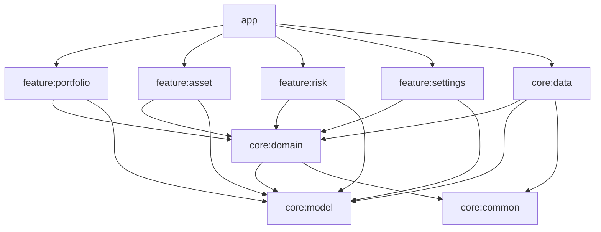
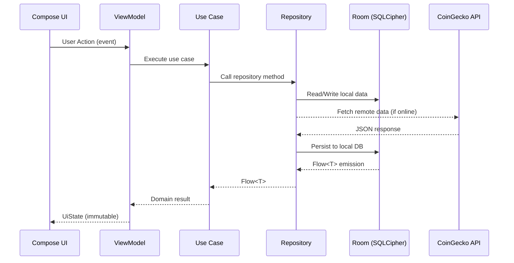

# Design Document: Custorix Android

## Overview

Custorix is a fintech-grade Personal Asset Ledger & Risk Analyzer for Android. It provides local-first portfolio tracking for crypto and fiat assets, real-time market data ingestion from CoinGecko, immutable transaction history, and risk/exposure analysis with scenario simulation.

The app follows Clean Architecture with a multi-module Gradle structure, Jetpack Compose UI with Navigation 3, and an offline-first data strategy where an encrypted local Room database (SQLCipher) serves as the single source of truth. All monetary calculations use `BigDecimal` to avoid floating-point precision errors. The reactive pipeline flows from Room → Kotlin Flow → ViewModel → Compose UI, ensuring unidirectional data flow.

### Key Design Decisions

| Decision | Choice | Rationale |
|---|---|---|
| Local DB | Room + SQLCipher | Mature Room DAO/Flow integration; SQLCipher provides transparent 256-bit AES encryption at rest (Req 10.1) |
| Network client | Retrofit + OkHttp | Widely adopted, interceptor-based rate-limit handling, built-in Moshi/Kotlinx Serialization converters |
| Navigation | Navigation 3 | Declarative backstack-as-list model, first-class multi-backstack support, deep link resolution (Req 11) |
| DI | Hilt | Standard Android DI, integrates with ViewModel, WorkManager, and Navigation (Req 14.3) |
| Property testing | Kotest Property | Kotlin-native PBT library with built-in `Arb` generators, configurable iteration count, JUnit5 runner |
| Monetary type | `BigDecimal` | Deterministic decimal arithmetic required for fintech (Req 1.2) |
| Async | Kotlin Coroutines + Flow | Room returns `Flow<T>` natively; structured concurrency for background work (Req 13.4) |

---

## Architecture

### Module Structure

```
custorix/
├── app/                          # Application entry, Hilt setup, MainActivity, Auth gate
├── core/
│   ├── model/                    # Shared domain models (Asset, Transaction, MarketData, etc.)
│   ├── domain/                   # Use cases, repository interfaces, risk calculator
│   ├── data/                     # Repository implementations, Room DAOs, Retrofit services, caching
│   └── common/                   # Shared utilities (BigDecimal extensions, Result wrappers, date utils)
├── feature/
│   ├── portfolio/                # Portfolio overview screen + ViewModel
│   ├── asset/                    # Asset detail screen + Add transaction screen + ViewModels
│   ├── risk/                     # Risk analysis screen + Scenario simulator + ViewModel
│   └── settings/                 # Settings screen + ViewModel
└── build-logic/                  # Convention plugins for shared Gradle config
```

**Package namespace:** `com.custorix.*`

### Dependency Graph



Feature modules depend on `core:domain` and `core:model` but never on `core:data` directly. The `app` module wires Hilt bindings that connect `core:data` implementations to `core:domain` interfaces.

### Unidirectional Data Flow

