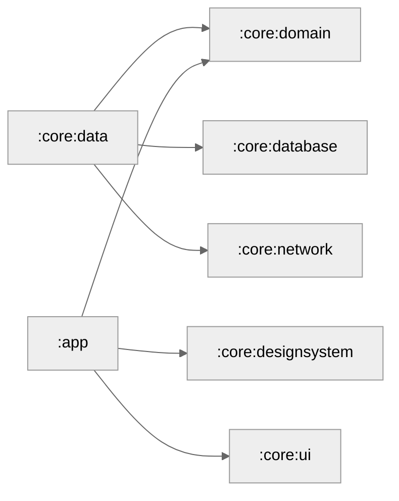

# Custorix

Personal Asset Ledger & Risk Analyzer  
Modern Android app built with Kotlin, Jetpack Compose, and Clean Architecture.

## Goals
- Demonstrate production-grade Android architecture
- Offline-first financial data modeling
- Risk and exposure analytics
- Scalable modular design

## Tech Stack
- Kotlin
- Jetpack Compose
- Navigation 3
- Room
- DataStore
- Coroutines + Flow
- Hilt

### Module Graph

> KMP version planned in a separate repository.
